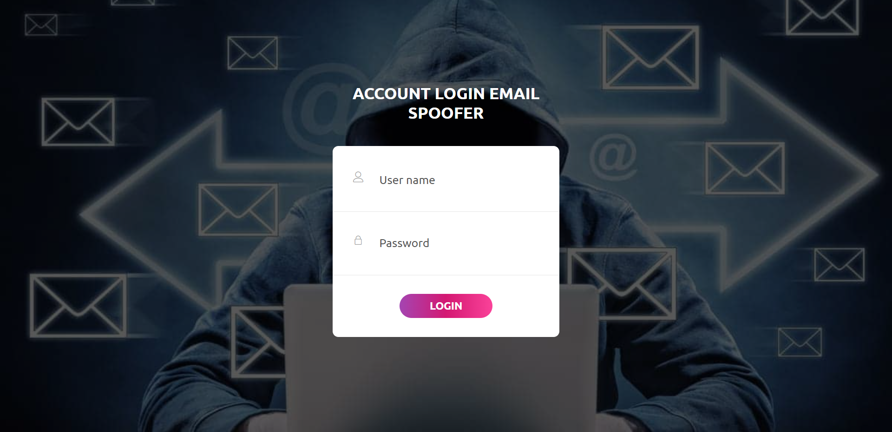

# Email spoofer

It is a simple Mail spoofer implemented by using sendinblue service
Email spoofing is the creation of email messages with a forged sender address.

<center>


</center>

<br>

# Technologies Used

```
Frontend      - Bootstrap,jQuery
Backend       - FastAPI
Database      - MongoDB Atlas
Email Service - SendinBlue
```

# Screenshots

## Login Page
<br>



## Send Spoof mail
<br>


<br>

# Project Motive

<h3>Project for Security in Computing</h3>